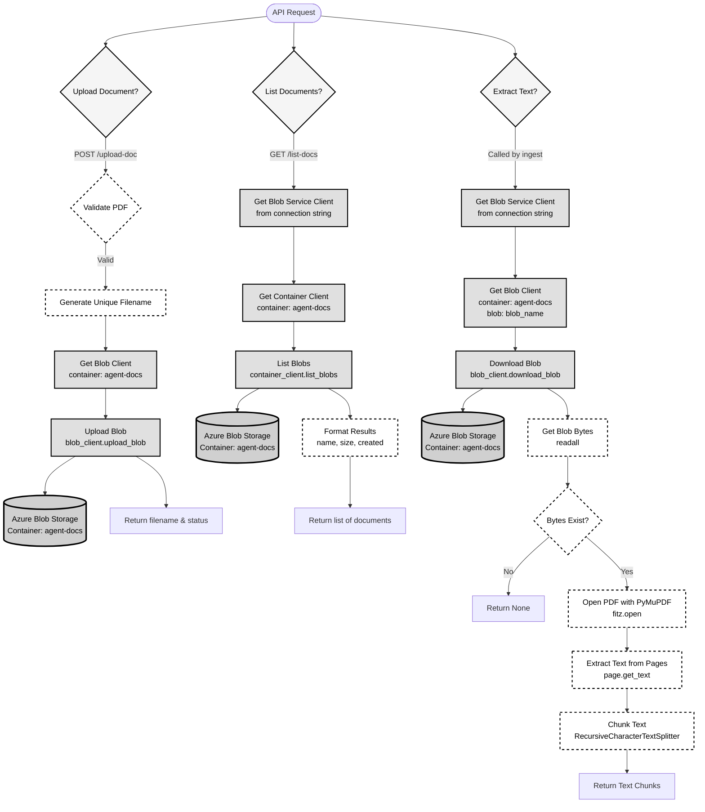

# Azure Blob Storage Flow Diagram

## Storage Account Services Used

### 1. **BlobServiceClient**
   - Initialized from `AZURE_STORAGE_CONNECTION_STRING`
   - Entry point for all blob operations

### 2. **Container Client** (`agent-docs`)
   - Operations: `list_blobs()`
   - Returns blob metadata (name, size, created date)

### 3. **Blob Client**
   - Operations:
     - `upload_blob()` - Upload PDF files
     - `download_blob()` - Download blob bytes
   - Container: `agent-docs`
   - Blob naming: `{uuid}-{filename}.pdf`

### 4. **Text Processing** (Storage-related)
   - `extract_text_from_blob()` - PDF text extraction using PyMuPDF
   - `chunk_text()` - Text splitting for processing

## API Endpoints

- **POST /upload-doc** → Uploads PDF to blob storage
- **GET /list-docs** → Lists all blobs in container
- **POST /ingest/{blob_name}** → Uses blob storage to extract and process text
